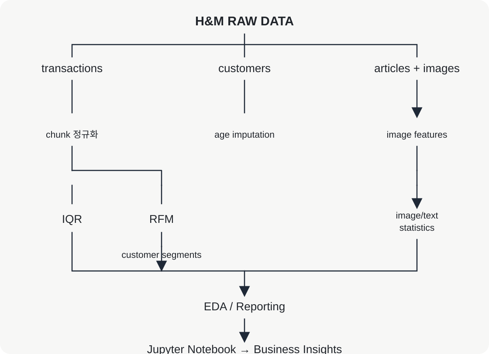

# H&M 고객가치 세분화 파이프라인



`notebooks/analysis_report.ipynb`를 열어 **Run All** 하면 H&M 전체 거래·고객·상품·이미지를 같은 코드로 분석한다. 원본 행과 이미지는 저장소에 포함하지 않는다. `price`는 데이터셋의 상대값이며 통화 금액으로 해석하지 않는다.

## 데이터와 범위

[H&M Personalized Fashion Recommendations](https://www.kaggle.com/competitions/h-and-m-personalized-fashion-recommendations)는 거래 날짜·고객 속성·상품 텍스트/카테고리·상품 이미지를 하나의 `article_id`로 결합할 수 있어 선택했다. 사용 전 [competition rules](https://www.kaggle.com/competitions/h-and-m-personalized-fashion-recommendations/rules)를 수락해야 하며, 원본/처리 데이터와 자격 증명은 재배포하지 않는다.

분석은 고객·거래·상품·이미지를 표본화하지 않는다. Pandas chunking으로 거래를 CSV cache에 기록하고, 이미지 하나씩 `matplotlib.image.imread`로 읽어 전체 배열에 `np.mean`, `np.std`를 적용한다. 픽셀에는 Python 반복문을 쓰지 않으며 이미지 전체를 한 텐서로 쌓지 않는다. 외부 분석 라이브러리는 NumPy, Pandas, Matplotlib, Seaborn뿐이다.

## 구조

`src/pipeline.py`의 `DataAnalyzer`가 public facade다. 전체 통합 거래 DataFrame은 만들지 않고 `transactions`, `customers`, `articles`, `product_features`를 각각의 grain으로 유지한다. 필요한 분석에서만 join하며, 노트북의 Dataset Inventory가 실행 시점의 shape와 schema를 보여준다.

- `load_data()` — 전체 거래 chunk 처리와 스키마 검증
- `handle_missing_values()` — 고객 단위 회원상태 그룹 중앙값 대치
- `engineer_features()` — 전체 이용 가능 이미지 Mean/Std와 상품명 길이
- `detect_outliers()` — 전체 가격 IQR
- `calculate_rfm()` — 고객 hash partition 기반 전체 RFM

나이 중앙값 대치는 고객 속성을 중복 거래마다 처리하지 않는 장점이 있지만 분산을 줄일 수 있다. IQR은 극단값에 강하지만 오른쪽으로 긴 정상 고가 상품을 이상치로 표시할 수 있다. RFM Frequency는 거래 행 수가 아니라 고유 구매일 수다.

## 로컬 실행

원본을 `data/raw/h-and-m`에 둔다.

```text
data/raw/h-and-m/
├── articles.csv
├── customers.csv
├── transactions_train.csv
└── images/
```

```bash
python3 -m venv .venv
.venv/bin/pip install -r requirements.txt
.venv/bin/python scripts/build_notebook.py
HM_RAW_DATA_DIR=data/raw/h-and-m .venv/bin/jupyter notebook notebooks/analysis_report.ipynb
```

다른 위치라면 `HM_RAW_DATA_DIR=/external/path`를 설정한다. 결과 cache는 기본 `data/runtime/` 또는 `HM_RUNTIME_DIR`에 생성되며 Git에서 무시된다.

이미 계산해 둔 결과를 로컬에서 재사용하려면 원본 데이터 대신 `HM_PRECOMPUTED_DIR`을 지정한다.

```bash
HM_PRECOMPUTED_DIR=/external/hm-precomputed .venv/bin/jupyter notebook notebooks/analysis_report.ipynb
```

해당 폴더에는 `processed/`, `features/`, `aggregates/` 아래의 분석 산출물이 있어야 한다. 필요한 파일이 없으면 원본 데이터 경로(`HM_RAW_DATA_DIR`)를 함께 지정해 다시 계산한다.

## Kaggle 실데이터 검증

1. 이 저장소와 이전 full-data Kaggle Notebook Version output을 Input으로 추가한다. 기본 경로가 다르면 `HM_PRECOMPUTED_DIR=/kaggle/input/...`를 설정한다.
2. H&M competition raw input은 artifact 누락 또는 `force=True` 재계산 때만 추가하면 된다.
3. `notebooks/analysis_report.ipynb`를 열고 **Run All** 한다.
4. 출력의 `transactions`, `product features`, `IQR`, `RFM`, `EDA`가 `REUSED`인지 확인한다.
5. 여섯 차트와 `Final execution summary`를 확인한 뒤 **Save Version** 한다. `/kaggle/input`에는 쓰지 않고 결과는 `/kaggle/working`에만 생성된다.

실데이터를 이 저장소 환경에서 실행하거나 수치를 미리 주장하지 않는다.

## Missing Value Handling: Age Imputation Strategy

`customers.csv`의 고객 연령(`age`)에는 결측값이 존재한다.  
전체 1,371,980명의 고객 중 15,861명의 연령이 결측이었으며, 결측률은 약 **1.156%**였다.

단순히 결측 행을 삭제하면 해당 고객의 거래 정보까지 분석 대상에서 제외될 수 있으므로, 본 프로젝트에서는 고객을 삭제하지 않고 **그룹별 통계량을 이용한 대치(Group-wise Imputation)** 방식을 사용하였다.

### 1. 그룹 변수 선택

연령 대치에 사용할 그룹 변수를 선택하기 위해 다음 후보를 비교하였다.

| Candidate | Missing Rate |
|---|---:|
| `club_member_status` | **0.442%** |
| `fashion_news_frequency` | 1.167% |
| `FN` | 65.238% |
| `Active` | 66.151% |

`FN`과 `Active`는 값 자체가 65% 이상 결측이므로 연령 대치 기준으로 사용하기 어렵다고 판단하였다.

따라서 비교 가능한 후보를 다음 두 변수로 좁혔다.

- `club_member_status`
- `fashion_news_frequency`

실제 연령 분포를 확인한 결과 `club_member_status`에서는 주요 그룹 간 연령 중앙값 차이가 나타났다.

| `club_member_status` | Customers with Known Age | Mean Age | Median Age |
|---|---:|---:|---:|
| ACTIVE | 1,266,255 | 36.08 | 31 |
| PRE-CREATE | 85,624 | 40.89 | 41 |
| LEFT CLUB | 464 | 33.99 | 29 |

특히 `ACTIVE`와 `PRE-CREATE` 그룹의 중앙값은 각각 **31세와 41세로 10세 차이**가 있었다.

반면 `fashion_news_frequency`의 주요 그룹인 `NONE`과 `Regularly`의 중앙값은 각각 31세와 32세로 차이가 상대적으로 작았다.

### 2. Hold-out Validation

그룹 선택을 임의로 결정하지 않기 위해 실제 연령이 존재하는 고객 중 일부를 검증 데이터로 분리한 뒤, 연령을 모르는 상황을 가정하여 대치값과 실제 연령의 차이를 비교하였다.

평가 지표로는 다음과 같은 MAE(Mean Absolute Error)를 사용하였다.

> MAE는 대치된 연령과 실제 연령이 평균적으로 몇 세 차이가 나는지를 나타낸다. 값이 작을수록 실제 연령에 더 가까운 대치 결과를 의미한다.

동일한 고객 집단과 동일한 train/test split을 사용한 비교 결과는 다음과 같다.

| Imputation Method | MAE | Improvement vs. Global Median |
|---|---:|---:|
| Global median | 12.0754 | - |
| `club_member_status` median | **11.9726** | **0.8519%** |
| `fashion_news_frequency` median | 12.0632 | 0.1016% |
| `club_member_status + fashion_news_frequency` median | **11.9565** | **0.9847%** |

두 변수를 결합한 방법이 가장 낮은 MAE를 보였지만, `club_member_status` 단독과의 차이는 약 **0.0161세**에 불과했다.

또한 실제 `age` 결측 고객에게 그룹 정보를 적용할 수 있는 비율은 다음과 같았다.

| Method | Coverage among Missing-Age Customers |
|---|---:|
| `club_member_status` | **85.59%** |
| `fashion_news_frequency` | 86.04% |
| `club_member_status + fashion_news_frequency` | 84.32% |

두 변수를 조합할 경우 두 컬럼이 모두 존재해야 하므로 coverage가 감소하고 그룹 수가 증가하여 작은 표본의 그룹이 더 많이 생성된다.

따라서 아주 작은 MAE 개선을 위해 복잡성과 coverage를 희생하기보다, **성능·적용 범위·설명 가능성의 균형이 좋은 `club_member_status`를 최종 그룹 변수로 선택하였다.**

### 3. Mean vs. Median

그룹 내부의 결측값을 평균(mean)과 중앙값(median) 중 어떤 값으로 대치할지도 데이터 기반으로 비교하였다.

가장 큰 고객 그룹인 `ACTIVE`의 연령 분포는 다음과 같았다.

- Mean: **36.08**
- Median: **31**
- Skewness: **+0.643**
- Mean–Median Gap: **5.08 years**

양의 skewness와 평균-중앙값 차이는 해당 연령 분포가 완전히 대칭적이지 않고 오른쪽 꼬리를 가진다는 것을 보여준다.

동일한 hold-out 데이터에서 그룹 평균과 그룹 중앙값 대치를 비교한 결과:

| Strategy | MAE | RMSE |
|---|---:|---:|
| Group Mean | 12.3962 | **14.2468** |
| Group Median | **11.9476** | 15.0651 |

중앙값 대치의 MAE는 평균 대치보다 약 **3.62% 낮았다**.

RMSE에서는 평균이 더 낮았는데, 이는 평균이 제곱오차를 최소화하는 대표값이라는 통계적 특성과 일치한다. 반면 중앙값은 절대오차에 더 강건하며, MAE를 최소화하는 대표값이다.

본 프로젝트의 목적은 연령을 정밀하게 예측하는 모델을 구축하는 것이 아니라, EDA와 고객 세분화를 계속 수행하기 위해 **결측 고객에게 해당 그룹의 전형적인 연령값을 안정적으로 대입하는 것**이다.

따라서 다음 이유로 중앙값을 선택하였다.

1. 주요 그룹의 연령 분포가 완전히 대칭적이지 않았다.
2. 중앙값은 극단적인 관측값의 영향을 평균보다 적게 받는다.
3. 동일한 hold-out 검증에서 중앙값의 MAE가 더 낮았다.
4. 결측 대치의 목적상 평균적인 절대 복원 오차를 해석하기 쉬운 MAE를 주요 기준으로 사용하였다.

### 4. Final Imputation Policy

최종 연령 결측치 처리 정책은 다음과 같다.

1. `age`가 존재하면 원래 값을 유지한다.
2. `age`가 결측이면 같은 `club_member_status` 그룹의 **median age**를 사용한다.
3. 그룹의 알려진 연령이 없어 그룹 중앙값을 계산할 수 없으면 전체 고객의 **global median age**를 fallback으로 사용한다.
4. 결측 고객 자체를 삭제하지 않는다.

예를 들어 그룹 중앙값이 계산된 그룹은 다음과 같았다.

| Group | Training Count | Median Age | Policy |
|---|---:|---:|---|
| ACTIVE | 1,012,976 | 31 | Group median |
| PRE-CREATE | 68,525 | 41 | Group median |
| LEFT CLUB | 373 | 29 | Group median |

현재 구현에는 그룹별 최소 표본 수 기준이 없다. 따라서 `LEFT CLUB`처럼 표본 수가 작은 그룹도 알려진 연령이 있으면 그룹 중앙값을 사용하며, 알려진 연령이 전혀 없는 그룹만 global median으로 fallback한다.

### 5. Limitations

그룹별 중앙값 대치는 실제 연령을 복원하는 모델이 아니라 대표값을 삽입하는 전처리 방법이다.

따라서 다음과 같은 한계가 있다.

- 동일 그룹의 여러 결측 고객에게 같은 값이 입력되므로 연령 분산이 감소할 수 있다.
- `club_member_status`가 연령을 강하게 예측하는 변수라고 해석해서는 안 된다. Hold-out MAE 개선 폭은 약 0.85%로 크지 않았다.
- 그룹 간 연령 차이가 실제 고객 행동 차이와 직접적인 인과관계를 의미하지 않는다.
- 더 정확한 연령 복원이 필요하다면 추가 고객 특성이나 별도의 예측 모델이 필요하지만, 이는 현재 EDA/RFM 미션의 범위를 벗어난다.

따라서 본 프로젝트에서는 **결측 행을 삭제하지 않으면서 데이터의 그룹 구조를 일부 반영하고, 단순성과 재현성을 유지하기 위한 보수적인 전처리 방법**으로 `club_member_status` 기반 그룹 중앙값 대치를 사용하였다.

## RFM 점수와 세분화 근거

R·F·M은 각각 percentile rank를 계산한 뒤 `[0, 0.25, 0.50, 0.75, 1.0]` 구간에 따라 1–4점을 부여한다. 고정 금액 기준을 임의로 만들지 않고 데이터 분포에서 고객의 상대적 위치를 비교하기 위한 선택이다. Recency는 작을수록 높은 점수, Frequency와 Monetary는 클수록 높은 점수를 받는다. 동점은 `rank(method="average", pct=True)`로 같은 percentile rank를 받으므로 같은 raw 값에는 항상 같은 점수가 부여된다. 이 정책에서는 동점 규모에 따라 점수별 고객 수가 정확히 같지 않을 수 있다.

세그먼트 규칙은 VIP(`R = 4`, `F = 4`, `M = 4`), Loyal(`R ≥ 3`, `F ≥ 3`), New(`R = 4`, `F ≤ 2`), Churned(`R = 1`), Potential(나머지) 순서로 적용한다. Notebook Run All은 각 그룹의 고객 수·고객 비중·Monetary 비중·평균 R/F/M을 계산하며, 실제 수치를 넣은 다음 세 가지 인사이트를 `artifacts/business_insights.md`에 생성한다.

## RFM 세그먼트 기준 검증

RFM 세그먼트의 이름이 실제 고객 행동과 일치하는지는 Notebook Run All에서 생성되는 고객 비중, Monetary 비중, 평균 Recency/Frequency/Monetary로 검토한다. 노트북은 scoring 및 boxplot 정책 변경이 기존 cache에 가려지지 않도록 RFM과 EDA artifact를 강제로 재계산한다.

VIP는 `R = 4, F = 4, M = 4`로 정의하여 세 지표가 모두 최상위 percentile 구간인 고객만 포함한다. 다만 동점을 같은 점수로 유지하므로 VIP 비중은 항상 고객의 정확히 25%나 그 조합 비율이 되지 않는다. Churned 역시 Recency 점수가 낮다는 신호일 뿐 실제 이탈을 확정하지 않으며, 모든 세그먼트의 타당성은 실행 시 생성되는 실제 분포를 함께 보고 판단한다.

## 비즈니스 인사이트

### 1. VIP 유지

- **근거:** VIP는 R·F·M이 모두 4점인 고객이며, Run All 결과의 VIP 고객 비중·Monetary 비중·평균 고유 구매일 수로 집중도를 판단한다.
- **실행:** VIP를 대상으로 신상품 조기 접근과 재입고 알림을 제공해 재방문 및 Monetary 유지를 기대한다.
- **검증:** 캠페인 노출·클릭·구매·홀드아웃 데이터가 필요하며, 대조군 대비 재방문율과 Monetary가 개선되지 않으면 가설을 기각한다.

### 2. Churned 재활성화

- **근거:** Churned는 Recency 점수가 1점인 고객이며, Run All 결과의 고객 비중·평균 Recency·평균 고유 구매일 수로 이탈 위험 규모를 판단한다.
- **실행:** Churned를 대상으로 동의 기반 복귀 메시지와 제한적 혜택을 실험해 90일 내 재구매율 상승을 기대한다.
- **검증:** 메시지 노출·수신 거부·쿠폰 비용·재구매 데이터가 필요하며, 복귀율이 개선되지 않거나 접촉 피로가 증가하면 중단한다.

### 3. Loyal의 VIP 전환

- **근거:** Loyal은 Recency와 Frequency 점수가 모두 3점 이상인 고객이며, Run All 결과의 고객 비중·Monetary 비중·평균 구매 빈도로 전환 가능성을 판단한다.
- **실행:** Loyal을 대상으로 구매 빈도 기반 단계형 혜택을 시험해 VIP 전환과 Monetary 상승을 기대한다.
- **검증:** 혜택 노출·재고·반품·마진 데이터가 필요하며, 순증 Monetary가 혜택 비용을 넘지 못하면 전략을 반증한다.

저장소에는 실행하지 않은 전체 데이터 수치를 미리 기록하지 않는다. Kaggle 전체 실행 후 생성되는 `business_insights.md`의 실제 수치를 README에 반영해야 최종 제출용 근거가 완성된다.

## 한계

단순 이미지 밝기/표준편차와 상품명 길이는 의미론적 이미지 모델이 아니다. 상관관계는 인과관계가 아니다. 전체 거래가 크므로 주요 병목은 CSV I/O와 이미지 디코딩이며, RFM은 고객 hash partition, 가격 IQR은 디스크 기반 NumPy 배열로 메모리 사용을 제한한다.
